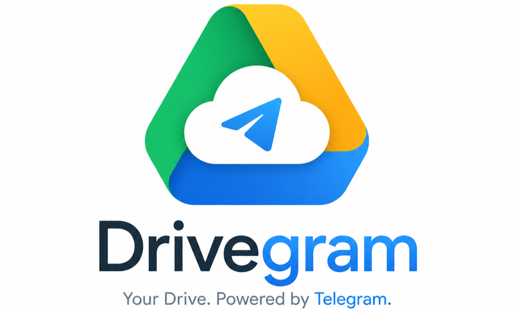

# DriveGram

DriveGram is a full-stack application that transforms your Telegram **Saved Messages** into a personal, high-performance cloud storage workspace. It enables you to manage your files with a modern UI while leveraging Telegram's secure and unlimited infrastructure.

> [!IMPORTANT]
> **Educational Purpose**: This project is built strictly for educational purposes to demonstrate MTProto integration with modern web stacks. All resources and libraries used are publicly available. 
> 
> **Requirement**: A Telegram User API (API ID + API Hash) is required to run this application. Get yours at [my.telegram.org](https://my.telegram.org).

## Key Features
- **Real-time Sync**: Automatically syncs with your Telegram **Saved Messages** in real-time.
- **Secure Login**: Authentication via official Telegram phone OTP.
- **File Management**: Upload, download, rename, and delete files with ease.
- **Modern UI**: Theme-aware dashboard with both Grid and List view modes.
- **Media Preview**: Integrated support for previewing images, videos, and audio directly in the browser.

## Tech Stack
- **Backend**: Go + Gin (MTProto integration via `gotd/td`)
- **Frontend**: Next.js + React + Tailwind CSS
- **Database**: SQLite (via GORM)
- **Containerization**: Docker + Docker Compose

---

## Deployment with Docker (Recommended)

Docker is the simplest way to run DriveGram. Follow these steps to set it up on your system:

### 1. Install Docker
First, ensure you have Docker Desktop installed on your computer:
- **Windows/Mac/Linux**: Download from [Docker Official Site](https://www.docker.com/products/docker-desktop/)

### 2. Prepare the Project
Open your terminal (Command Prompt, PowerShell, or Terminal) and follow these commands:

```bash
# 1. Clone the repository
git clone https://github.com/piyushkumar-prog/DriveGram

# 2. Navigate to the project folder
cd DriveGram

# 3. Create your environment file
cp .env.example .env
```
*Note: Open the `.env` file and fill in your `TELEGRAM_API_ID` and `TELEGRAM_API_HASH`.*

### 3. Launch the Application
Run the following command to build and start everything:
```bash
docker-compose up --build
```

### 4. Access the Dashboard
Once the logs show the server is running, open:
**[http://localhost:8088](http://localhost:8088)**

---

## Manual Setup Guide

If you prefer to run the application locally without Docker:

### 1. Requirements
- Go (1.25+), Node.js (18+), and Git.

### 2. Steps
```bash
# 1. Clone the repository
git clone https://github.com/piyushkumar-prog/DriveGram
cd DriveGram

# 2. Setup Backend
go mod tidy
go run main.go

# 3. Setup Frontend (In a new terminal)
cd frontend
npm install
npm run build
```

---

## Project Structure

```text
DriveGram/
+- internal/        # Go backend logic and MTProto services
+- frontend/        # Next.js frontend source code
+- data/            # Local SQLite database and sessions (Auto-generated)
+- Dockerfile       # Multi-stage Docker build file
+- docker-compose.yml
+- main.go          # Application entry point
```

---

## Troubleshooting

- **Login Fails**: Ensure your API ID and Hash are correct in `.env`.
- **Sync Issues**: Logout and login again to refresh the MTProto session.
- **Docker**: Make sure Docker Desktop is running before executing `docker-compose`.

---

## Security Notes
- Your Telegram session is stored locally in `./data`. **Never share this folder.**
- Keep your `.env` file private.

---

## License
This project is licensed under the terms in `LICENSE`.
